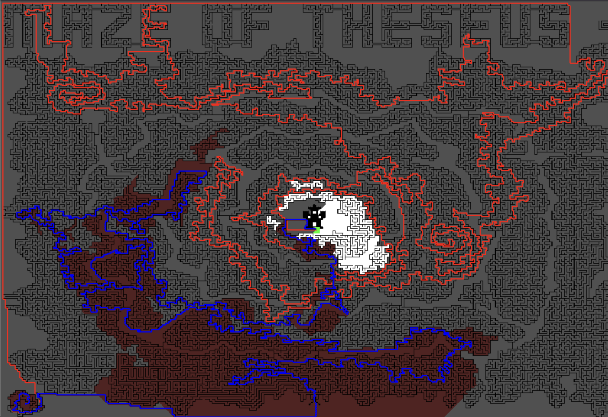

# opencv-bfs-astar-maze-solver
This project uses the A star and breadth first search algorithms to find the path between 2 pixels  
```
python -m venv maze_env
```  
```
source maze_env/bin/activate
```  
```
pip install -r requirements.txt
```  
```
python maze.py
```  



